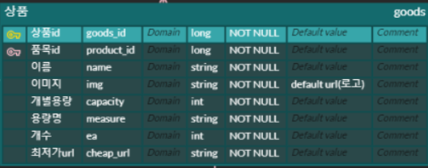

## 목차

+ [1. 파일 목록 및 형식](##1.-파일-목록-및-형식)
  + [[1] Table](###[1]-Table)
  + [[2] Pickle](###[2]-Pickle)
+ [2. 설명](##2.-설명)
  + [[1] category](###[1]-category)
  + [[2] product](###[2]-product)
  + [[3] goods]([3]-goods)


## 1. 파일 목록 및 형식

### [1] Table

**설명**

+ DB에 넣을 데이터를 csv 형태로 저장한 것


**종류**

+ category_table

  

+ product_table

  

+ product_price_table

  

+ goods_table

  

+ goods_price_table

  


### [2] Pickle

**설명**

+ name과 id 관계를 pickle 파일 형태로 저장한 것
  + dictionary file


**종류**

+ categoryName_categoryId.pickle
  + {카테고리 이름 : 카테고리 id } 형태로 모아둔 것
    + 예 : { '채소' : 9 }
+ productName_productId.pickle
  + { 품목 이름 : 품목 id } 형태로 모아둔 것
    + 예 : { '빙과류': 4 }
+ goodsName_goodsId.pickle
  + { 상품 이름 : 상품 id } 형태로 모아둔 것
    + 예 : { '사과(후지)' :  20000, }


**python에서 로드하는 법**

```python
import pickle
with open('categoryName_categoryId.pickle','rb') as fr:
    categoryName_categoryId = pickle.load(fr)

```


## 2. 설명

### [1] category

+ 총 12개 카테고리


### [2] product

+ 총 165개 품목

+ 참가격

  + id

    + 0 ~ 109

  + 110개 품목

    

+ 농산물
  + id
    + 1000 ~ 1054
  + 55개 품목


### [3] goods

+ 총 480개 상품

+ 참가격

  + id

    + 0 ~ 422

  + 423개 상품

    

+ 농산물

  + id
    + 20000 ~ 20056
  + 57개 상품